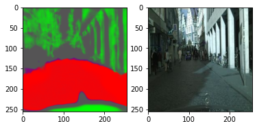
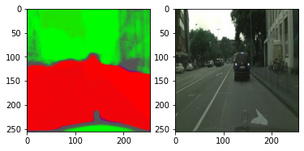
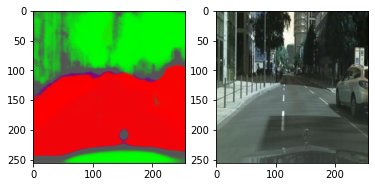
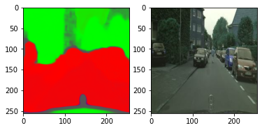
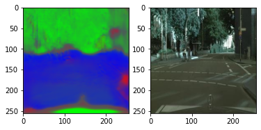
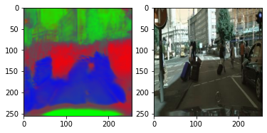
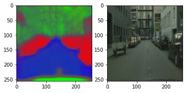
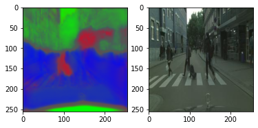

<h1>SEMANTIC SEGMENTATION<h1>
  
# Introduction :
  Semantic segmentation describes the process of associating each pixel of an image with a class label, (such as flower, person, road, sky, ocean, or car).           Applications for semantic segmentation include: Autonomous driving. 

# Dataset :
  
  Here, is a <a href = "https://www.kaggle.com/dansbecker/cityscapes-image-pairs">link</a> to the dataset which I have used. 
  This dataset has 2975 training images files and 500 validation image files. Each image file is 256x512 pixels, and each file is a composite with the original       photo on the left half of the image, alongside the labeled image (output of semantic segmentation) on the right half.
  
# UNets Model:
  
  
# Result and Analysis :
  To get an idea of output, I trained the moel for less time interval (or for less number of epochs). Here, is a table to summarise my study. 
  However, in the folders <B>sematic_output</B> and <B>Semantic_out_2</B>, I have put all my results. 
  
  <table align = "center">
    <tr>
      <td></td>
    </tr>
    <tr>
      <td></td>
    </tr>
    <tr>
      <td></td>
    </tr>
    <tr>
      <td></td>
    </tr>
  </table>
   
  
<B> However, after some slight changes in the model, I got these results.</B>

   
  <table align = "center">
    <tr>
      <td></td>
    </tr>
    <tr>
      <td></td>
    </tr>
    <tr>
      <td></td>
    </tr>
    <tr>
      <td></td>
    </tr>
  </table>
  
# To Do :
<ol>
  <li>Introduce heat waves.</li>
  <li>use of t-SNE analysis on the landmarks</li>
</ol>
